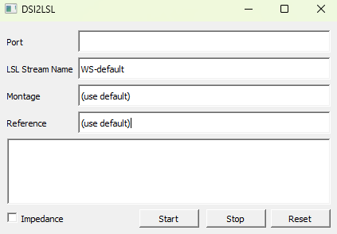

# How to Use

This will be a quick overview of the Wearable Sensing LSL plugin and its features.



Before you can start your LSL stream, make sure your headset is properly connected to your computer using bluetooh or usb. Once properly connected, go to ```Device Manager``` in your Windows search bar and locate the COM port the headset is connected to.

* A wireless connection will be listed under the ```Bluetooth``` section.

* A wired connection will be found under ```Ports (COM & LPT)```.

Go back to ```dsi2lslGUI```, inside of ```Port``` enter 'COM' followed by the number in your dropdown. You are now ready to start consuming the DSI data.


```{admonition} GUI Buttons
:class: tip

```Start``` - Begins the active LSL stream.

```Stop``` - Stops the active LSL stream.

```Reset``` - Sends an analog reset to the amplifier.

```Impedance``` - If checked, Impedance driver will be on after you click ```Start```.

```
See {doc}`LSL-Tools <tools>` for guides on consuming your LSL data.
