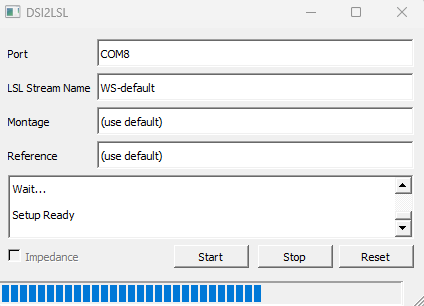

# Getting Started with dsi2lslGUI

This will be a quick overview of how to use the Wearable Sensing LSL plugin and its features.

## Connecting the DSI Headset

Before you can start your LSL stream, make sure your headset is properly connected to your computer using bluetooth or usb. Once properly connected, go to `Device Manager` in your Windows search bar and locate the COM port the headset is connected to.

* A wireless connection will be listed under the `Bluetooth` section.

* A wired connection will be found under `Ports (COM & LPT)`.

Go back to `dsi2lslGUI`, inside of **Port** enter **'COM'** followed by the number from your dropdown (e.g., `COM8`). You are now ready to start consuming the DSI data.


> Initial `dsi2lslGUI` window when first opened.



> `dsi2lslGUI` window after clicking `Start`.

```{admonition} GUI Buttons
:class: tip

`Start` - Begins the active LSL stream.

`Stop` - Stops the active LSL stream.

`Reset` - Sends an analog reset to the amplifier.

`Impedance` - If checked, Impedance driver will be on after you click `Start`.

```

## Configuring Montage and Reference (Optional)

```{admonition} Note
:class: sidebar note
Use `-` or `/` to define differences or averages. 
```

You can optionally override which EEG channels are streamed by typing into the **Montage** box a comma-seperated list of channels you wish to record.

* **Montage** set to only record `C3`, `C4`, and `Pz`.

```sh
C3,C4,Pz
```

You can optionally override where the EEG channels are referenced to by typing into the **Reference** box. Enter the difference or average of channels you wish to reference.

* Setting channel reference to average of `C3` and `C4`.

```sh
C3/2+C4/2
```

See {doc}`LSL-Tools <tools>` for guides on consuming your LSL data.
