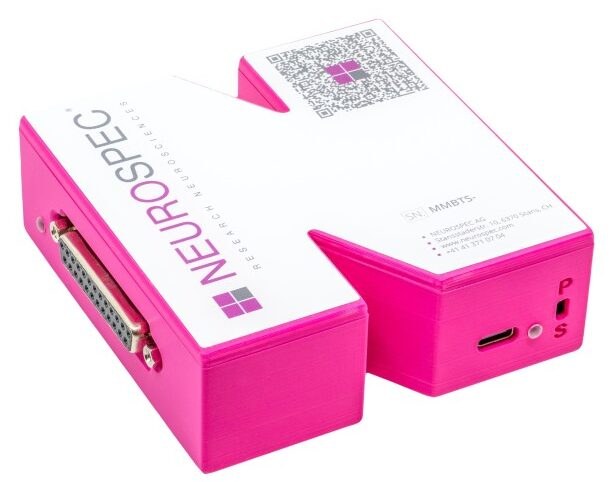
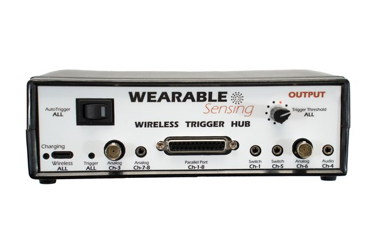

# Triggers and Event Alignment

```{figure} ../../../_static/images/examples/psychopy/psychopy-serial.png
:alt: DSI-Streamer showing trigger rises on the Trigger channel after serial bytes are sent from PsychoPy
:align: center
:width: 500px
:text-align: center

DSI-Streamer showing trigger rises on the Trigger channel after serial bytes are sent from PsychoPy via the MMBT-S.
```

A **trigger** (also called an **event marker** or **stim marker**) marks the exact moment something happens in an experiment or application. This could be a stimulus appearing on screen, a user responding, or a game event firing. The term varies by field and software, but the concept is the same: a timestamped signal recorded alongside EEG data so brain activity can be extracted time-locked to each event.

Accurate alignment matters in both workflows:

- **Offline / ERP analysis:** Triggers define the epochs cut from a continuous recording. A timing error shifts every epoch by the same amount, distorting ERP waveforms and reducing statistical power.
- **Real-time BCI:** During calibration, triggers define the training windows. Bad markers mean the classifier trains on the wrong data. During online control, each trigger also drives backend reshaping by telling the backend where to cut the next window for classification. Timing inconsistency at either stage degrades accuracy.

For supported trigger types and device-specific bit depths, see {doc}`What type of external triggers are supported? <../../../faq/triggers/questions/trigger-types>`.

## Trigger Methods

### Hardware Triggers

Hardware triggers write codes directly to the DSI trigger channel at stimulus onset, bypassing network and OS scheduling. This gives the lowest and most consistent latency.

The recommended device is the **[MMBT-S](https://wearablesensing.com/mmbt/)**, a USB-to-serial adapter that connects to your stimulus computer and converts serial writes into TTL pulses on the DSI trigger channel. Your stimulus software (PsychoPy, Unity, custom scripts) writes a trigger value at each event onset. The **[Trigger Hub](https://wearablesensing.com/wireless-trigger-hub/)** is an alternative when you need to consolidate multiple trigger sources or require input types the MMBT-S does not support.

```{raw} html
<div style="display: flex; gap: 2rem; justify-content: center; align-items: flex-start; margin: 1.5rem 0;">
  <figure style="text-align: center; flex: 1; max-width: 220px;">
    <a href="https://wearablesensing.com/mmbt/" target="_blank">
      
    </a>
    <figcaption style="font-size: .8rem; color: #6c757d; margin-top: 0.5rem;"><a href="https://wearablesensing.com/mmbt/" target="_blank">MMBT-S</a> — USB-to-serial trigger adapter</figcaption>
  </figure>
  <figure style="text-align: center; flex: 1; max-width: 220px;">
    <a href="https://wearablesensing.com/wireless-trigger-hub/" target="_blank"></a>
    <figcaption style="font-size: .8rem; color: #6c757d; margin-top: 0.5rem;"><a href="https://wearablesensing.com/wireless-trigger-hub/" target="_blank">Trigger Hub</a> — multi-source trigger consolidator</figcaption>
  </figure>
</div>
```

**Guides:** {doc}`Hardware Triggers with PsychoPy <../../../examples/psychopy/hardware>`, {doc}`Unity Integration <../../../examples/game-vr/unity>`

### Software Triggers (LSL Markers)

LSL markers are sent as a timestamped stream from your stimulus application and synchronized with the EEG stream at the recording level.

- No additional hardware required; works across the network
- Compatible with any LSL-enabled application (PsychoPy, Unity, custom scripts)
- Introduces a measurable timing offset and some jitter that must be accounted for in analysis

**Guides:** {doc}`Software Triggers with PsychoPy <../../../examples/psychopy/software>`, {doc}`LSL Integration <../../../examples/lsl/index>`

## Measuring and Correcting Trigger Offset

Every trigger method introduces a delay between when a trigger is sent and when the stimulus actually reaches the participant. This offset depends on your setup: the presentation software, stimulus type, hardware, and OS. There is no universal value. Measure it for your specific setup and remeasure whenever anything changes, such as the computer, software, stimulus type, or hardware.

**Visual stimuli:** Attach a photodiode to the screen. It detects the physical light change and records the true onset on the DSI trigger channel, which you compare against your trigger signal. See the {doc}`Photodiode Experiment <../../../examples/tooling/diode/photodiode>` guide for a full walkthrough using PsychoPy.

**Audio stimuli:** Use a Y-splitter to route your audio output. Send one side to your speakers and the other into the Trigger Hub audio input. The Hub records the audio onset on the trigger channel for comparison.

The {doc}`Offset Analysis <../../../examples/tooling/diode/offset>` tool computes mean offset, standard deviation, and drift across trials. Once measured, apply the offset as a fixed correction to event timestamps during epoching or real-time processing.

## Offline Use: ERP and Epoch-Based Analysis

Triggers are the anchors around which epochs are cut from a continuous recording.

- Each trigger value should map to a condition (e.g., `1` = target, `2` = non-target). Consistent coding is what allows you to average across trials and recover condition-specific ERP components.
- Apply your measured offset when epoching so time-zero aligns with true stimulus onset, not when the trigger was sent.

**Guides:** {doc}`MNE-Python Epoching <../../../examples/mne/python/processing/epochs>`

## Real-Time Use: BCI and Game Development

In real-time applications, triggers serve three roles:

1. **Calibration markers:** Each stimulus onset is marked so the backend can extract time-locked windows and train a classifier. Marker quality directly determines classifier performance.
2. **Online window reshaping:** During live control, each trigger tells the backend where to cut the next classification window. Inconsistent timing produces misaligned epochs and degrades live accuracy even with a well-trained model.
3. **Prediction delivery:** The backend sends classification results to the game engine to drive in-game events.

On the backend, keep the processing loop tight. Buffer EEG into fixed-size windows, process each window as it fills, and send results immediately. Avoid blocking I/O on the processing thread.

**Guides:** {doc}`MNE-LSL Epoching <../../../examples/mne/lsl/processing/epochs>`, {doc}`Game Development Best Practices <../../../examples/game-vr/best-practices>`

## Resources

- {doc}`Triggers and Timing FAQ <../../../faq/triggers/index>` — Supported trigger types and device specs
- {doc}`Software Triggers (PsychoPy) <../../../examples/psychopy/software>` — Send LSL markers from a stimulus application
- {doc}`Hardware Triggers (PsychoPy) <../../../examples/psychopy/hardware>` — Send serial port triggers via MMBT-S
- {doc}`Photodiode Experiment <../../../examples/tooling/diode/photodiode>` — Measure your system's trigger offset
- {doc}`Offset Analysis <../../../examples/tooling/diode/offset>` — Visualize and quantify timing accuracy
- {doc}`MNE-LSL Epoching <../../../examples/mne/lsl/processing/epochs>` — Epoch continuous data around event markers
- {doc}`Best Practices & Tooling <../../../examples/game-vr/best-practices>` — Real-time pipeline architecture
