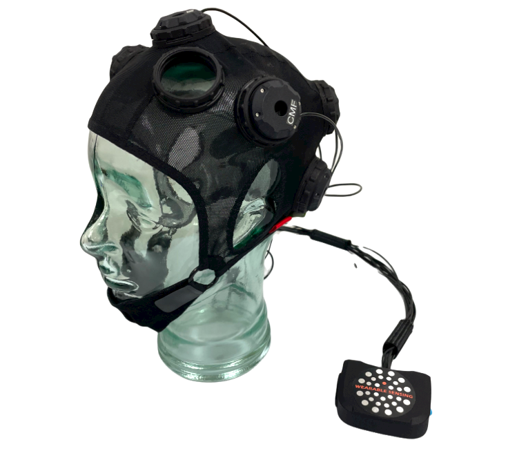

# Wearable Sensing Support

**Everything you need to work with our EEG technology!**  [Learn more about us →](help/about)

```{raw} html
<div style="display: flex; gap: 12px; margin: 1em 0 1.5em 0; flex-wrap: nowrap;">
  
  
  
  
  
</div>
```

```{admonition} New here?
:class: tip
Start with our [Tutorials](help/tutorials/index) or explore the **Quick Links** below.
```

## Quick Links 

````{grid} 2
:gutter: 4

```{grid-item-card} Get Started
:link: help/tutorials/index
:link-type: doc
---
Step-by-step hardware and internal software tutorials
```

```{grid-item-card} Downloads
:link: help/downloads/index
:link-type: doc
---
Essential drivers, software tools, user guides, and third-party plugins
```

```{grid-item-card} Integrations
:link: examples/index
:link-type: doc
---
Connect with popular platforms and third-party libraries
```


```{grid-item-card} API Reference
:link: api/index
:link-type: doc
---
Comprehensive DSI-API documentation, guides, and error codes
```

```{grid-item-card} FAQ
:link: faq/index
:link-type: doc
---
Common questions and troubleshooting tips
```

```{grid-item-card} Contact Support
:link: help/index
:link-type: doc
---
Get in touch with our support team for personalized assistance
```
````

---

```{toctree}
:maxdepth: 3
:hidden:

   Integrations <examples/index>
   Tutorials <help/tutorials/index>
   Downloads <help/downloads/index>
   FAQ <faq/index>
   About <help/about>
   Contact <help/index>
   API <api/index>
```